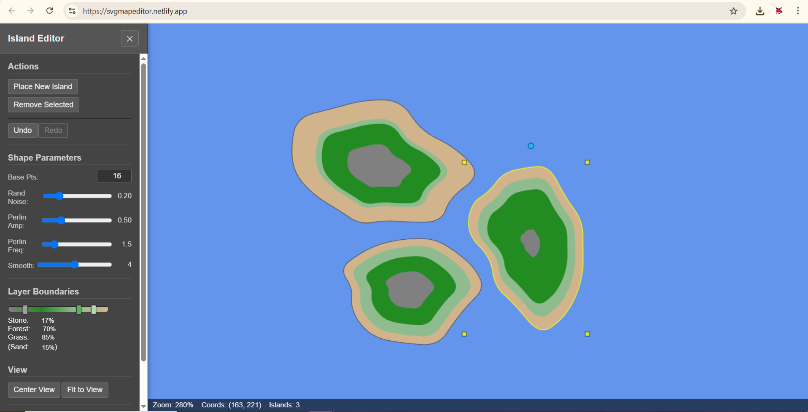

# SVG Map Editor

**Live Demo:** [https://svgmapeditor.netlify.app/](https://svgmapeditor.netlify.app/)

## Description

An interactive SVG-style map editor for creating procedural island terrains. Features include:

- Vector-based island generation
- Customizable terrain layers (sand, grass, forest, stone)
- Real-time shape manipulation
- Exportable map data

## Features

- **Procedural Generation**: Noise-based terrain shaping
- **Layer Control**: Adjustable elevation boundaries
- **Transform Tools**: Move, rotate, and scale islands
- **History Stack**: Undo/Redo support
- **SVG-Compatible**: Exportable to vector formats
- **Responsive UI**: Works on desktop browsers

## Controls

- **Left Click/Drag**: Select and move islands
- **Right Click**: Context menu (regenerate/select)
- **Mouse Wheel**: Zoom in/out
- **Middle Mouse Drag**: Pan viewport
- **Delete Key**: Remove selection
- **T Key**: Toggle sidebar
- **P Key**: Create new island
- **C Key**: Center view

## Technical Implementation

- HTML5 Canvas rendering
- Noise.js algorithm
- Chaikin curve smoothing
- MIT Licensed open-source

## License
MIT License
